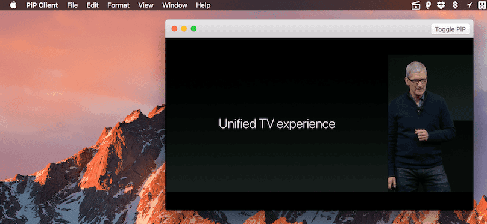
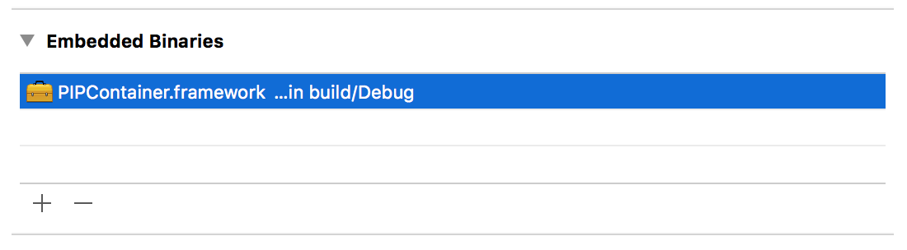
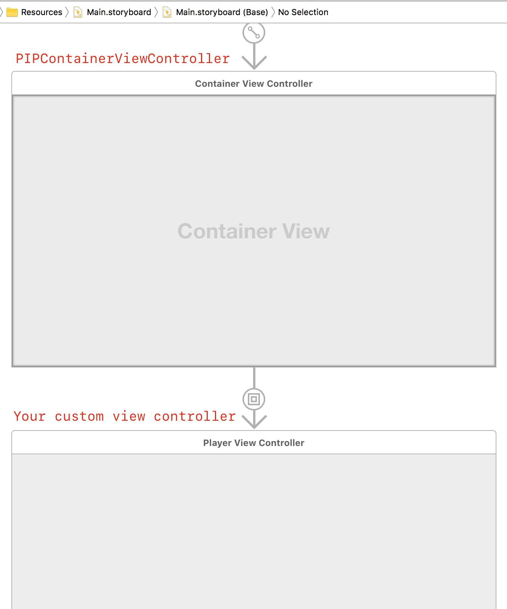

If you want to support my open source projects financially, you can do so by purchasing a copy of [BrowserFreedom](https://getbrowserfreedom.com), [Mediunic](https://itunes.apple.com/app/mediunic-medium-client/id1088945121?mt=12) or sending Bitcoin to `3DH9B42m6k2A89hy1Diz3Vr3cpDNQTQCbJ` 😁

# PIPContainer

[](https://github.com/Carthage/Carthage) []()

An `NSViewController` subclass that can present its child view controller in picture-in-picture mode.

Please note that this project links against `PIP.framework`, which is private. Don't try to submit apps using this to the App Store.



# Integration

## Carthage

Add the following line to your `Cartfile` and follow the [integration instructions for Carthage](https://github.com/Carthage/Carthage#adding-frameworks-to-an-application):

```
github "insidegui/PIPContainer" ~> 1.0
```

## CocoaPods

Add the following line to your `Podfile` and then run `pod install`:

```
pod 'PIPContainer'
```

## Manually

Drag `PIPContainer.xcodeproj` to your project and add `PIPContainer.framework` to the `Embedded Binaries` section.



# Usage

## Containment

The way it works is you add the view controller you want to display in the PiP as a child view controller of `PIPContainerViewController`. This can all be done using storyboards ([see demos](./Demo)).



## Entering and Exiting PiP mode

After you have the correct containment setup, simply call `togglePIP` on `PIPContainerViewController` to enter/exit PiP mode.

```swift
private var pip: PIPContainerViewController? {
    return parent as? PIPContainerViewController
}
    
func togglePictureInPictureMode() {
    pip?.togglePIP(nil)
}
```

You can also link UI controls like buttons and menus directly to the `togglePIP` action in Interface Builder by control-dragging to the First Responder and selecting the action `togglePIP:`.

## Getting notified about PiP commands

`PIPContainerViewController` has many block properties that you can use to get notifications about state changes.

- `pipDidPause`: Called when the pause button is pressed in the PiP panel
- `pipDidPlay`: Called when the play button is pressed in the PiP panel
- `pipWillOpen`: Called when the PiP panel is about to be opened. This is the best moment to set the `isPlaying` property of `PIPContainerViewController` to reflect the state of your player
- `pipWillClose`: Called when the PiP panel is about to be closed
- `pipDidClose`: Called after the PiP panel is closed and the view controller is back to its original position

## Demos

I encourage you to have a look at the demos to get a better understanding of how PIPContainer works:

- [ObjC demo](./Demo/ObjC)
- [Swift demo](./Demo/Swift)